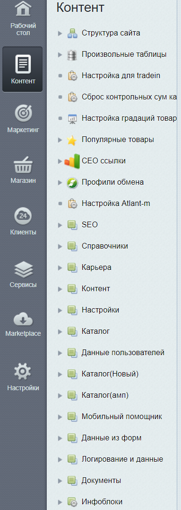

Руководство для контент-менеджера
=================================
  
## Основные вкладки админ.панели 1с-Bitrix
  
  
Панель администрирования CMS 1с-Bitrix включает в себя следующее основные вкладки:
- Рабочий стол
- Контент
- Маркетинг 
- Магазин
- Клиенты
- Сервисы
- Marketplace
- Настройки

>Основным разделом панели администратора 1с-bitrix для работы с контентом является ***контент*** 
  
### ***Контент***
Вкладка контент включает в себя следующие разделы: 
- Структура сайта
- Произвольные таблицы
- Настройка для tradein
- Сброс контрольный сум каталога 
- Настройка градаций товара
- Популярные товары 
- SEO ссылки
- Инфоблоки
- Highload-блоки

#### Структура сайта
> Описание раздела  
 
;

#### ...
>...

