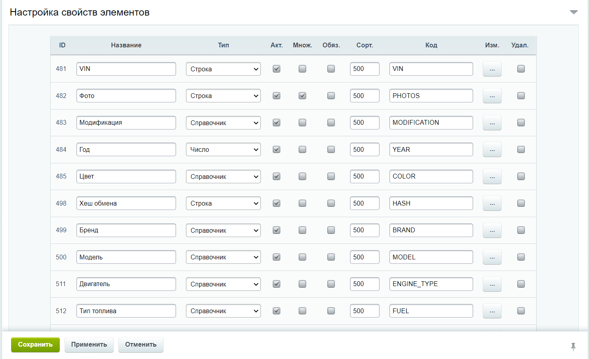
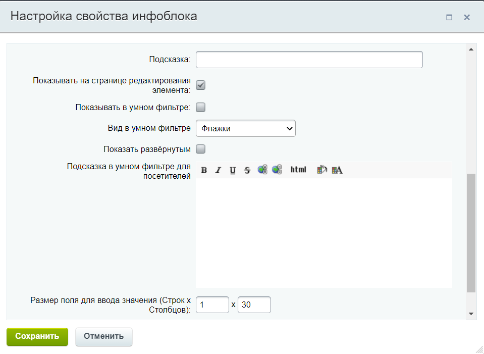
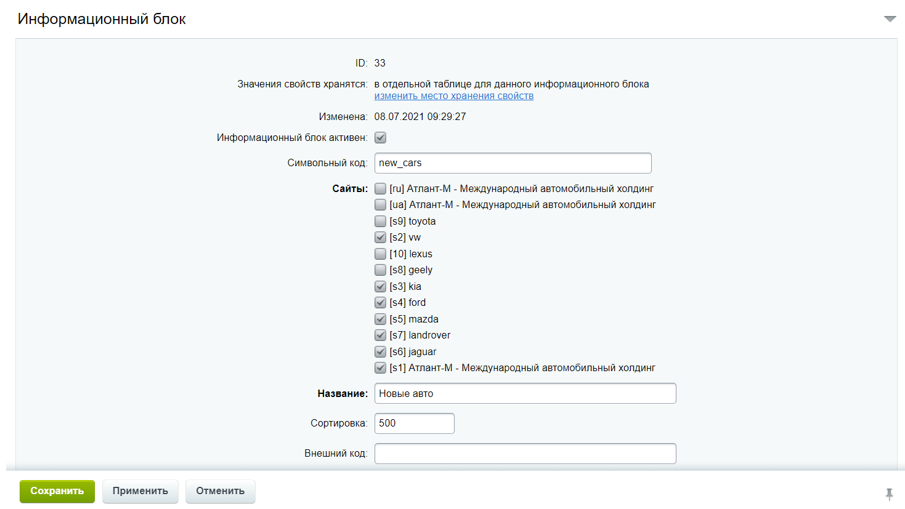

Новые авто  
========================  
  
::: warning  
"***Новые авто***" используется для хранения основной информации о товаре (новом автомобиле).
:::  
"***Новые авто***" имеет свойства включающие следующие основные пункты:  
- *Название*  
- *Тип*  
- *Код*  
- *Подсказка*  
- *Множественное*  
- *Обязательное*  
  
***Фото***     
>Свойство используется для хранения пути на место хранения фото товара(нового автомобиля), которая в будущем будет отображаться на страницах сайта.
   
***...***  
>Свойство используется для ...

| Название | Тип    | Множ. | Обяз.| Код |
|:--------:|:------:|:-------:|:------:|:-----:|
| VIN | Строка | - | - | VIN |
| Фото | Строка | - | - | PHOTOS |
| Модификация | Cправочник | + | - | MODIFICATION |
| Год | Число | + | - | YEAR |
| ... | ... | ... |... | ... |  
  

  

***Подсказка*** находится в настройках свойства блока  
  
  
  
Информационный блок также имеет следующие основные пункты описания:  
- *Символьный код*
- *Название*
- *ID*  
  

